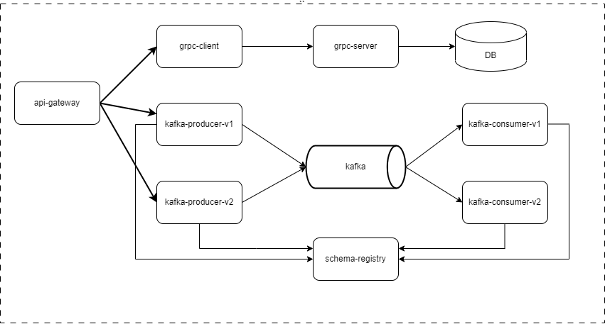

# GRPC Module

## Diagram

## Task 1:
* Added Grpc client and server based on JAVA and Spring and using grpc schema (interface module);
* Added tests;

## Task 2:
* Added Kafka producers for V1 and V2 schema versions;
* Added Kafka consumers (V1 fully supports schema V1 and schema V2 without Gender field - forward compatible type; V2 fully supports schema V2 and schema V1 with default Gender field - backward compatible type);